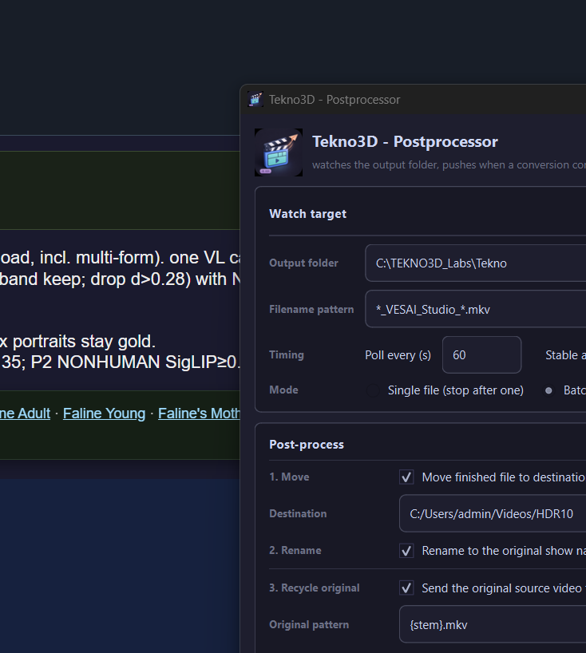
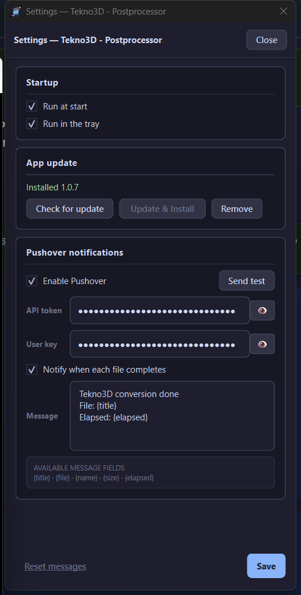

# Tekno3D - Postprocessor

  

  
  
  
  

---

## What is this? (plain English)

**Tekno3D - Postprocessor is the helper that waits while Tekno3D Video Enhance Studio finishes a job, then tidies up for you.**

Tekno writes long-named MKVs into an output folder (and leaves indexes / JSON next to them). This app:

1. **Watches** that folder for a finished file (default pattern: `*_VESAI_Studio_*.mkv`)  
2. When the file stops growing (stable for a few seconds)…  
3. Runs your **post-process** checklist  
4. Optionally **pings your phone** via Pushover (“conversion done”)

You do **not** re-encode video here. You run this **beside** Tekno so you can walk away: files land where you want them, names get cleaned, leftovers go to the Recycle Bin, and you get a notification.

### What happens when a file finishes

| Step | In plain words |
|------|----------------|
| **1 · Move** | Copy/move the finished MKV out of Tekno’s output folder into your real library folder. |
| **2 · Rename** | Strip Tekno’s long suffix (`_DolbyVision_…_VESAI_Studio_…`) back to the original show name. |
| **3 · Recycle original** | Send the *source* video (and its index) to the Recycle Bin after a successful move. |
| **4 · Cleanup** | Recycle leftover sidecars Tekno left behind (`.ffindex`, vapoursynth JSON, logs, …). |
| **5 · Run script** | Optional: launch a `.exe` / `.bat` / PowerShell / Python when everything else is done. |

Modes: **Single file** (stop after one) or **Batch** (keep watching). Can start with Windows, sit in the **tray**, and check for **App updates** from Settings.

---

## Screenshots

  

<em>Main window — watch folder, filename pattern, move / rename / recycle / cleanup.</em>

  

<em>Settings — run at start / tray, App update, Pushover messages.</em>

---

## How to use (quick start)

1. Install from [Releases](https://github.com/aberthil/Tekno3DPostprocessor-releases/releases/latest) and open **Tekno3D - Postprocessor**.  
2. Set **Output folder** to the same folder Tekno writes into (or drop the folder onto the field).  
3. Leave the default filename pattern unless you use a custom Tekno naming scheme.  
4. Tick the post-process steps you want (Move destination, rename, recycle, cleanup).  
5. Optional: **Settings** → enable Pushover and send a test.  
6. Click **Start watching** (or enable *Run at start* so it begins when the app opens).  
7. Run your Tekno jobs as usual — when an MKV matches and goes stable, the checklist runs.

**Log** and **Settings** dock beside the main window (same style as the Dolby Vision apps).

---

## Download

| | |
|--|--|
| **Latest Setup** | [Tekno3DPostprocessor-1.0.7-Setup.exe](https://github.com/aberthil/Tekno3DPostprocessor-releases/releases/latest/download/Tekno3DPostprocessor-1.0.7-Setup.exe) |
| **All versions** | [Releases](https://github.com/aberthil/Tekno3DPostprocessor-releases/releases) |
| **SHA-256** | [Tekno3DPostprocessor-1.0.7-Setup.exe.sha256](https://github.com/aberthil/Tekno3DPostprocessor-releases/releases/latest/download/Tekno3DPostprocessor-1.0.7-Setup.exe.sha256) |

> Prefer the **latest** tag always:  
> https://github.com/aberthil/Tekno3DPostprocessor-releases/releases/latest

Installs to `C:\DolbyVisionScripts\Tekno3DPostprocessor` by default. Settings and Pushover keys live in AppData and **survive App Update**. Only a full **Remove** wipes them.

---

## Requirements

| | |
|--|--|
| OS | Windows 10/11 **x64** |
| Companion | [Tekno3D Video Enhance Studio](https://tekno3d.com/) (or similar) writing MKVs to a watched folder |
| Optional | [Pushover](https://pushover.net/) account for phone / desktop push alerts |
| GPU | Not required (this app only watches files and tidies them) |

---

## Install

1. Download **Tekno3DPostprocessor-*-Setup.exe** from [Releases](https://github.com/aberthil/Tekno3DPostprocessor-releases/releases/latest)  
2. Run Setup (admin)  
3. Launch **Tekno3D - Postprocessor** from the Finish page / Start Menu  

**Update the app:** Settings → App update → Check for update → Update & Install  
(keeps AppData userdata)

---

## What's New

### v1.0.7

See the [Releases](https://github.com/aberthil/Tekno3DPostprocessor-releases/releases) page for notes on each Setup build.

---

## Links

- **Latest download:** https://github.com/aberthil/Tekno3DPostprocessor-releases/releases/latest  
- **This repo:** public Setup hosting + project page (source stays private)

---

## License / support

Windows installers for end users. Problems with a specific Setup: note the release tag and contact the publisher (`aberthil`).
